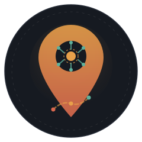
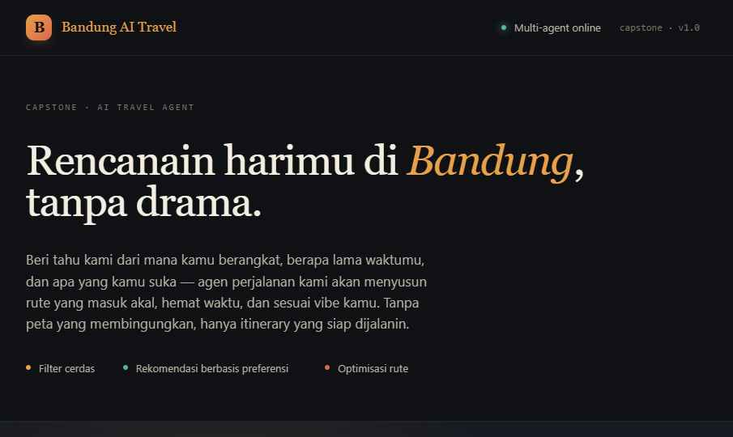
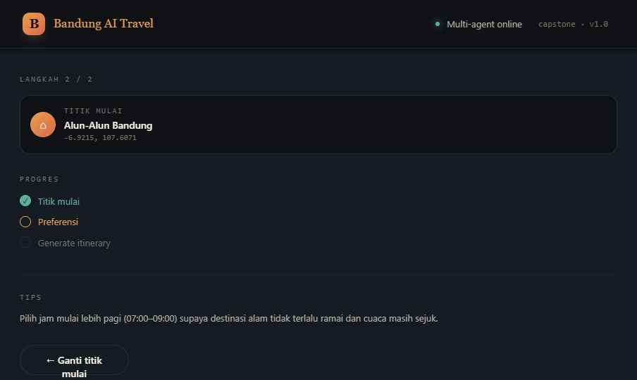
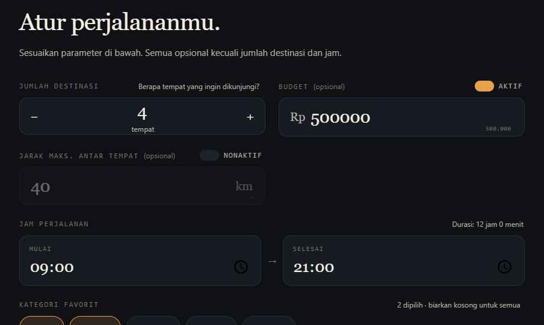

<div align="center">
  

  # GuideYou&AI

  **Itinerary planner berbasis AI untuk wisata Bandung Raya.**
  Masukkan titik keberangkatan, preferensi kategori, budget, dan jam perjalanan, sistem menyusun rute kunjungan yang optimal lengkap dengan narasi cerita yang dihasilkan LLM.

  
  
  
  
  

  **Capstone Project · Program Studi Sains Data · Telkom University**
</div>

---

## Daftar Isi

- [Tentang Proyek](#tentang-proyek)
- [Tampilan Aplikasi](#tampilan-aplikasi)
- [Arsitektur Sistem](#arsitektur-sistem)
- [Fitur Utama](#fitur-utama)
- [Dataset dan Model](#dataset-dan-model)
- [Struktur Direktori](#struktur-direktori)
- [Menjalankan Secara Lokal](#menjalankan-secara-lokal)
- [Referensi API](#referensi-api)
- [Deployment](#deployment)
- [Evaluasi Model](#evaluasi-model)
- [Pembagian Tugas](#pembagian-tugas)
- [Catatan Teknis](#catatan-teknis)
- [Referensi](#referensi)

---

## Tentang Proyek

GuideYou&AI merencanakan itinerary wisata satu hari di kawasan Bandung Raya secara otomatis. Mesin rekomendasi menggabungkan Content-Based Filtering dan Reinforcement Learning untuk memilih destinasi yang relevan dengan preferensi pengguna, lalu menyusun urutan kunjungan dengan heuristik TSP nearest-neighbor agar rute tidak bolak-balik tanpa arah. Setiap itinerary yang dihasilkan disertai narasi perjalanan dalam Bahasa Indonesia yang ditulis oleh LLM.

Proyek dibangun sebagai capstone Program Studi Sains Data, Telkom University, dengan dataset 1.459 destinasi di kawasan Bandung Raya yang dikumpulkan dari OpenStreetMap.

---

## Tampilan Aplikasi

<table>
<tr>
<td width="33%">

**Layar awal**



</td>
<td width="33%">

**Pemilihan titik mulai**



</td>
<td width="33%">

**Pengaturan preferensi**



</td>
</tr>
</table>

---

## Arsitektur Sistem

```
┌─────────────────────────────────┐         ┌────────────────────────────────────────┐
│         React Frontend          │         │         FastAPI Backend (Railway)      │
│           (Vercel)              │         │                                        │
│                                 │         │  Startup → recommender.py load model: │
│  WelcomeScreen (pilih lokasi)   │         │    ├── destinations.csv (1.459 data)  │
│  FormScreen    (isi preferensi) │         │    ├── cbf_model.pkl     (1459×1459)   │
│  LoadingScreen (animasi proses) │  HTTP   │    ├── rl_agent.pkl      (Q-table)     │
│  ResultsScreen (tampil hasil)   │ ──────► │    └── scaler.pkl                      │
│                                 │  POST   │                                        │
│  ◄──── JSON {steps, story} ──── │/api/plan ├── recommender.py                      │
│                                 │         │    ├── Filter (kategori + Haversine)   │
│  Timeline rute putus-putus      │         │    ├── CBF Scoring (cosine similarity) │
│  Story card (narasi LLM)        │         │    ├── RL Q-table (greedy selection)   │
│  Google Maps link per destinasi │         │    └── TSP Route Optimizer (NN)        │
└─────────────────────────────────┘         │                                        │
                                            │── llm_storyteller.py                   │
                                            │    ├── Groq API (llama-3.1-8b-instant) │
                                            │    ├── Retry 3x (backoff 1-8 detik)    │
                                            │    └── Fallback template deterministik │
                                            └────────────────────────────────────────┘
```

### Alur permintaan `/api/plan`

```
Input pengguna
    │
    ▼
[1] Filter kandidat berdasarkan kategori dan jarak Haversine dari titik mulai
    │
    ▼
[2] CBF scoring melalui cosine similarity dari feature matrix (one-hot kategori, numerik, TF-IDF tag)
    │
    ▼
[3] Kategori-first reservation, lalu RL Q-table memilih destinasi tambahan secara greedy
    │
    ▼
[4] TSP nearest-neighbor menyusun urutan rute dari titik mulai
    │
    ▼
[5] Perhitungan jadwal: jam tiba, durasi singgah, jam berangkat per pemberhentian
    │
    ▼
[6] Groq LLM menghasilkan narasi perjalanan (POV orang kedua, 80-120 kata)
    │
    ▼
Respons JSON dirender frontend sebagai itinerary
```

---

## Fitur Utama

- **Rekomendasi personal.** Kombinasi Content-Based Filtering dan Reinforcement Learning (Q-Learning) memilih destinasi sesuai preferensi kategori, budget, dan rentang waktu.
- **Reservasi kategori proporsional.** Setiap kategori yang dipilih pengguna dijamin terwakili di itinerary sebelum slot sisanya diisi oleh hasil Q-Learning, sehingga rekomendasi tidak didominasi satu kategori dengan reward tertinggi.
- **Optimasi rute.** Heuristik TSP nearest-neighbor menyusun urutan kunjungan yang efisien dari titik keberangkatan.
- **Sadar budget dan waktu.** Hard-gate constraint memastikan total biaya tiket dan durasi perjalanan tetap dalam batas yang ditentukan pengguna.
- **Narasi otomatis.** Cerita perjalanan dalam Bahasa Indonesia dihasilkan oleh Groq Llama-3.1-8b-instant, dengan fallback deterministik bila API tidak tersedia.
- **1.459 destinasi.** Dataset Bandung Raya dari OpenStreetMap, terbagi atas kategori Alam, Kuliner, dan Wisata.
- **Lima preset titik keberangkatan** (Alun-Alun Bandung, Stasiun Bandung, Pasar Lembang, Dago, Gedung Sate) dengan opsi deteksi lokasi GPS.
- **Tautan Google Maps** untuk setiap destinasi pada hasil itinerary.

---

## Dataset dan Model

### Dataset

| Atribut | Detail |
|---|---|
| File | `backend/data/destinations.csv` |
| Jumlah destinasi | 1.459 |
| Distribusi kategori | Alam: 722 · Kuliner: 645 · Wisata: 92 |
| Rentang rating | 3,6 - 4,8 |
| Rentang tiket | Rp 0 - Rp 249.000 |
| Durasi kunjungan | 55-270 menit |
| Kolom | `id`, `name`, `category`, `desc`, `ticket`, `duration`, `lat`, `lng`, `rating`, `tags`, `stay_detail`, `gmaps_url`, `source` |
| Sumber | OpenStreetMap melalui Overpass API, dengan enrichment manual untuk sejumlah destinasi kuliner ikonik |
| Pembaruan terakhir | 2026-05-25 |

Bounding box crawling kawasan Bandung Raya: `-7.2500, 107.3500, -6.7500, 107.9000`.

### Model artifacts

| File | Deskripsi |
|---|---|
| `backend/models/cbf_model.pkl` | Similarity matrix `(1459×1459)`, feature matrix `(1459, 28)`, dan `df_index` |
| `backend/models/rl_agent.pkl` | Q-table hasil 3.000 episode training |
| `backend/models/scaler.pkl` | MinMaxScaler untuk fitur numerik |
| `backend/models/label_encoders.pkl` | Encoder kategori dan TF-IDF tags |

**Komposisi feature CBF:**
- One-hot kategori
- Fitur numerik yang dinormalisasi: ticket, duration, rating, lat, lng
- TF-IDF dari kolom `tags` dan `desc`

Pipeline lengkap pelatihan model tersedia pada `notebooks/rec-engine.ipynb` (training CBF dan RL) dan `notebooks/llm-train.ipynb` (eksperimen integrasi LLM storyteller).

---

## Struktur Direktori

```
Bandung_AI_Travel-Capstone-Project/
│
├── backend/                          # Layanan FastAPI, dideploy ke Railway
│   ├── main.py                       # Entry point: /, /api/health, /api/plan
│   ├── recommender.py                # CBF + Q-Learning + TSP scheduler
│   ├── llm_storyteller.py            # Wrapper Groq LLM (retry + fallback)
│   ├── data/
│   │   ├── destinations.csv          # Dataset runtime (1.459 destinasi)
│   │   └── last_updated.txt          # Tanggal pembaruan dataset
│   ├── models/                       # Artefak pickle runtime
│   │   ├── cbf_model.pkl
│   │   ├── rl_agent.pkl
│   │   ├── scaler.pkl
│   │   └── label_encoders.pkl
│   ├── requirements.txt
│   ├── runtime.txt                   # Python 3.11
│   ├── railway.json                  # Konfigurasi deploy Railway
│   └── Procfile
│
├── frontend/                         # Aplikasi React, dideploy ke Vercel
│   ├── src/
│   │   ├── App.jsx                   # Root: alur welcome → form → loading → results
│   │   ├── components/
│   │   │   ├── WelcomeScreen.jsx     # Pemilihan titik keberangkatan
│   │   │   ├── FormScreen.jsx        # Input preferensi (kategori, budget, jam)
│   │   │   ├── LoadingScreen.jsx     # Animasi proses saat memanggil API
│   │   │   └── ResultsScreen.jsx     # Timeline rute, story card, tautan Google Maps
│   │   ├── api/
│   │   │   └── client.js             # Wrapper fetch ke backend Railway
│   │   ├── data/
│   │   │   └── homeOptions.js        # Preset titik keberangkatan dan kategori
│   │   └── utils/
│   │       └── format.js             # Helper format jam, rupiah, kilometer
│   ├── package.json
│   └── vercel.json                   # Aturan rewrite SPA
│
├── notebooks/
│   ├── rec-engine.ipynb              # Pipeline training CBF dan RL (Kaggle)
│   └── llm-train.ipynb               # Eksperimen LLM storyteller
│
├── docs/
│   ├── api/
│   │   ├── sample_request.json
│   │   └── sample_response.json
│   ├── branding/
│   │   └── logo.svg                  # Logo GuideYou&AI
│   └── screenshots/                  # Tangkapan layar tampilan UI
│
├── models/                           # Mirror artefak untuk referensi
├── scripts/
│   └── apply-kaggle-artifacts.sh    # Skrip penerapan model hasil training Kaggle
└── requirements.txt                  # Dependensi untuk menjalankan ulang notebook training
```

---

## Menjalankan Secara Lokal

### Prasyarat

- Python 3.11 atau lebih baru
- Node.js 18 atau lebih baru
- API key Groq, dapat dibuat gratis di [console.groq.com](https://console.groq.com)

### 1. Backend

```bash
cd backend

# Buat virtual environment
python -m venv venv
source venv/bin/activate          # Windows: venv\Scripts\activate

# Instal dependensi
pip install -r requirements.txt

# Konfigurasi environment
cp .env.example .env
# Edit .env, isi GROQ_API_KEY

# Jalankan server
uvicorn main:app --reload --port 8000
```

Server berjalan di `http://localhost:8000`. Status kesehatan dapat dicek di `http://localhost:8000/api/health`.

### 2. Frontend

```bash
cd frontend

# Instal dependensi
npm install

# Jalankan development server
npm start        # terbuka di http://localhost:3000
```

Secara default frontend memanggil `http://localhost:8000`. URL backend dapat diubah melalui file `.env.local`:

```
REACT_APP_API_URL=http://localhost:8000
```

---

## Referensi API

### `GET /api/health`

Mengembalikan status backend, jumlah destinasi yang dimuat, dan status model.

```json
{
  "status": "ok",
  "last_updated": "2026-05-25",
  "n_destinations": 1459,
  "model_loaded": true,
  "cbf_loaded": true,
  "sim_matrix_shape": [1459, 1459],
  "q_table_size": 146,
  "groq_configured": true
}
```

### `POST /api/plan`

Menghasilkan itinerary beserta narasi perjalanan.

**Request body:**

```json
{
  "home": { "lat": -6.9215, "lng": 107.6071 },
  "homeName": "Alun-Alun Bandung",
  "count": 4,
  "maxKm": 25,
  "startMin": 540,
  "endMin": 1260,
  "budget": 400000,
  "categories": ["Alam", "Kuliner", "Wisata"]
}
```

| Parameter | Tipe | Keterangan |
|---|---|---|
| `home` | object | Koordinat titik keberangkatan `{lat, lng}` |
| `homeName` | string | Nama lokasi awal, digunakan untuk narasi |
| `count` | int (1-8) | Jumlah destinasi yang diinginkan, default 4 |
| `startMin` | int | Menit-of-day mulai, contoh 540 = 09:00 |
| `endMin` | int | Menit-of-day selesai, contoh 1260 = 21:00, minimal 90 menit setelah `startMin` |
| `budget` | int, opsional | Total budget tiket dalam rupiah |
| `maxKm` | float, opsional | Jarak maksimal antar destinasi dalam kilometer |
| `categories` | array, opsional | Subset dari `["Alam", "Kuliner", "Wisata"]`; kosong berarti semua kategori |

**Response (ringkas):**

```json
{
  "steps": [
    {
      "idx": 1,
      "dest": {
        "id": "kebun-binatang-bandung",
        "name": "Kebun Binatang Bandung",
        "category": "Wisata",
        "ticket": 60000,
        "duration": 150,
        "rating": 4.1,
        "gmaps_url": "https://www.google.com/maps/search/?api=1&query=Kebun%20Binatang%20Bandung%2C%20Bandung"
      },
      "travelMin": 2,
      "travelKm": 2.46,
      "arriveAt": 542,
      "departAt": 692
    }
  ],
  "totalCost": 239000,
  "totalKm": 69.08,
  "totalTime": 653,
  "returnKm": 24.43,
  "returnMin": 64,
  "arriveHome": 1193,
  "overBudget": false,
  "spareMin": 67,
  "story": {
    "story": "Trip Bandung kamu dimulai dari Kebun Binatang Bandung...",
    "vibe": "Alam · Kuliner · Wisata Umum"
  },
  "data_last_updated": "2026-05-25"
}
```

`arriveAt` dan `departAt` dinyatakan dalam menit dari tengah malam, dikonversi ke format `HH:MM` melalui `divmod(menit, 60)`. Contoh lengkap tersedia pada [`docs/api/sample_request.json`](docs/api/sample_request.json) dan [`docs/api/sample_response.json`](docs/api/sample_response.json).

---

## Deployment

Proyek dideploy menggunakan dua platform dengan tingkat layanan gratis.

### Backend, Railway

| Setting | Nilai |
|---|---|
| Root Directory | `backend` |
| Build Command | `pip install -r requirements.txt` |
| Start Command | `uvicorn main:app --host 0.0.0.0 --port $PORT` |
| Health Check | `/api/health` |

Environment variable yang wajib diset pada dashboard Railway:

```
GROQ_API_KEY     = gsk_xxxxxxxxxxxx
GROQ_MODEL       = llama-3.1-8b-instant
ALLOWED_ORIGINS  = https://bandung-travel.vercel.app
```

### Frontend, Vercel

| Setting | Nilai |
|---|---|
| Root Directory | `frontend` |
| Framework | Create React App |
| Build Command | `npm run build` |

Environment variable produksi:

```
REACT_APP_API_URL = https://bandung-travel-api.up.railway.app
```

Setiap `git push` ke branch `main` memicu redeploy otomatis pada Railway dan Vercel.

---

## Evaluasi Model

Hasil evaluasi dari skenario simulasi pada notebook training:

| Metrik | Nilai |
|---|---|
| Category coverage | 97,0% |
| Distance compliance | 100,0% |
| Budget compliance | 83,0% |
| Rating rata-rata | 4,32 / 5,0 |
| Jarak total rata-rata | 47,0 km |
| Biaya total rata-rata | Rp 185.640 |
| Variety index rata-rata | 0,97 |
| Jumlah pemberhentian rata-rata | 3,31 |

---

## Pembagian Tugas

**Kelompok 6 · Program Studi Sains Data, Telkom University**

| Nama | NIM | Peran |
|---|---|---|
| Arkhan Falih Fahrie Puspita | 103052330051 | Backend, Recommendation System (CBF + RL) |
| Avatar Bintang Ramadhan | 103052300007 | Backend, LLM Storyteller |
| Azza Zukhrufa | 103052300014 | Frontend, React UI |
| Azzahra Sabryna Anggara | 103052300018 | Integrasi end-to-end |

### Arkhan Falih Fahrie Puspita, Backend Recommendation System

Bertanggung jawab atas pipeline rekomendasi di `backend/recommender.py`:
- Pengumpulan data melalui Overpass API (OpenStreetMap) dan preprocessing dataset 1.459 destinasi
- Feature engineering: one-hot encoding, MinMaxScaler, TF-IDF tags
- Content-Based Filtering menggunakan cosine similarity matrix `(1459×1459)`
- Reinforcement Learning (Q-Learning) dengan simulated environment, 3.000 episode training
- Heuristik TSP nearest-neighbor untuk optimasi urutan rute
- Sistem reservasi kategori-first untuk menjamin representasi tiap kategori
- Notebook training: `notebooks/rec-engine.ipynb`

### Avatar Bintang Ramadhan, Backend LLM Storyteller

Bertanggung jawab atas integrasi LLM di `backend/llm_storyteller.py`:
- Integrasi Groq API dengan model `llama-3.1-8b-instant`
- System prompt untuk narasi POV orang kedua, 80-120 kata
- Mekanisme retry tiga kali dengan exponential backoff (1s, 3s, 8s)
- Fallback template deterministik saat Groq tidak tersedia atau rate-limited
- Penegakan format respons JSON dan sanitasi POV
- Eksperimen LLM: `notebooks/llm-train.ipynb`

### Azza Zukhrufa, Frontend React

Bertanggung jawab atas seluruh tampilan di `frontend/src/`:
- Alur screen linear: `WelcomeScreen → FormScreen → LoadingScreen → ResultsScreen`
- `WelcomeScreen`: deteksi lokasi GPS dengan opsi lima preset titik keberangkatan
- `FormScreen`: input preferensi kategori, budget, jam mulai dan selesai, jumlah destinasi
- `LoadingScreen`: animasi proses dengan indikator progres
- `ResultsScreen`: timeline rute putus-putus, story card narasi, tautan Google Maps per destinasi
- Styling responsif melalui CSS custom properties

### Azzahra Sabryna Anggara, Integrasi End-to-End

Bertanggung jawab atas penyambungan seluruh komponen:
- Integrasi `main.py` (FastAPI) dengan Recommender dan LLM Storyteller
- API client `frontend/src/api/client.js` dan penyelarasan schema frontend dan backend
- Konfigurasi CORS, environment variable, dan deployment Railway serta Vercel
- Pengujian end-to-end: alur request, penanganan error, perilaku fallback
- Pembaruan model artifacts dari hasil training Kaggle ke production (`scripts/apply-kaggle-artifacts.sh`)

---

## Catatan Teknis

### Reservasi kategori-first

`recommender.py` melakukan reservasi slot per kategori secara proporsional sebelum proses Q-Learning mengisi slot sisanya. Mekanisme ini mencegah agen RL terlalu condong pada kategori dengan reward tertinggi, sehingga kategori pilihan pengguna tetap terwakili dalam itinerary.

### Kompatibilitas dua format CBF

Loader pickle mendukung dua skema output notebook:
- Format baru: `{"similarity_matrix": ndarray, "df_index": [...]}`
- Format lama: `{"sim_matrix": ndarray, "id_to_sim_idx": {...}}`

Fallback berjalan otomatis tanpa perlu perubahan kode saat versi model berganti.

### Pembaruan model ke production

```bash
# Opsi A, dari branch updateVer
git fetch origin updateVer
git cat-file -p updateVer:HASIL_TERBARU/working/models/cbf_model.pkl > backend/models/cbf_model.pkl

# Opsi B, dari hasil ekspor Kaggle berupa ZIP
./scripts/apply-kaggle-artifacts.sh /path/to/bandung-travel-artifacts.zip
```

Setelah commit dan push ke `main`, Railway melakukan redeploy otomatis dan dapat diverifikasi melalui `/api/health`.

---

## Referensi

- Dataset: [OpenStreetMap](https://www.openstreetmap.org/) melalui Overpass API
- LLM: [Groq API](https://console.groq.com), Llama-3.1-8b-instant
- Backend framework: [FastAPI](https://fastapi.tiangolo.com/)
- Frontend hosting: [Vercel](https://vercel.com)
- Backend hosting: [Railway](https://railway.app)
- ML: [scikit-learn](https://scikit-learn.org/), cosine similarity dan MinMaxScaler

---

<div align="center">

**Capstone Project Kelompok 6 · Program Studi Sains Data · Telkom University · 2026**

</div>
